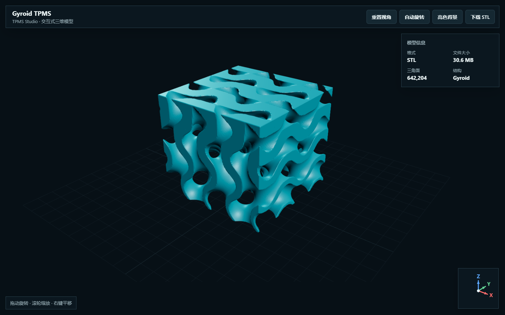

# TPMS Studio

TPMS Studio 是一个本地运行的 TPMS 参数化建模桌面工具，可生成封闭表面模型，并为 COMSOL 流体仿真准备带边界分组和质量数据的体网格。

支持 **Gyroid、Diamond、Primitive、I-WP、Neovius** 五种 TPMS 曲面，以及片层结构、实体结构和目标孔隙率控制。

[版本更新](CHANGELOG.md) · [开发记录、技术决策与已知限制](DEVELOPMENT_LOG.md)

## 核心功能

| 功能模块 | 主要能力 |
| --- | --- |
| TPMS 参数化建模 | 支持五种典型曲面、片层/实体结构、三轴尺寸、周期数量、壁厚和等值面偏移控制 |
| 数学公式组合 | 支持自定义隐式函数，以及 `min/max` 并集、交集和差集组合 |
| 孔隙率设计 | 按目标孔隙率自动反求片层壁厚或实体等值面偏移，并显示实际孔隙率和误差 |
| 高精度模型生成 | 使用连续隐式距离场提取等值面，封闭六个外边界并自动清理游离碎片 |
| GPU 三维预览 | OpenGL 实时旋转与缩放，支持随模型旋转的 XYZ 方向标、重置视角、暗色/亮色背景和高精度导出 |
| 表面模型导出 | 输出 STL、OBJ、PLY，可用于切片、打印及后续几何处理 |
| CFD 体网格 | 自动构造孔隙流体域和入口/出口/壁面分组，生成棱柱边界层与四面体核心网格 |
| 网格自适应 | 支持入口/出口局部加密、曲率自适应以及边界层首层高度、层数和增长率控制 |
| 质量分析 | 模型生成后即可按需计算缩放雅可比直方图、低质量单元定位、质量统计和 VTU 完整质量场 |
| 仿真区域可视化 | 模型生成后即可按入口、出口和壁面着色显示，并提供颜色图例 |

## 界面预览

### 在线三维模型

[](https://starlre.github.io/TPMS-Studio/)

点击上图可在 GitHub Pages 中加载 `gyroid_tpms.stl`，支持拖动旋转、滚轮缩放、右键平移、自动旋转、重置视角、深浅背景切换和 STL 下载。模型约 `30.6 MB`，首次打开会显示加载进度；模型右下角的 XYZ 方向标使用红 X、绿 Y、蓝 Z 标注并随视角同步更新。

### TPMS 参数化建模与实时预览


上图是模型生成完成后的主界面（`1520×960`，`Slate/Teal` 现代设计系统，基准 `19px`）。窗口采用“左侧参数栏 + 右侧三维视口”的工程软件布局：参数始终位于固定操作区，视口保持独立，适合反复调整、生成并对照检查模型。

| 界面区域 | 内容与作用 |
| --- | --- |
| 顶部工具栏 | 深 slate `#0f172a` + `2px teal` 底线；“导出模型”保存 STL/OBJ/PLY；“导出 COMSOL 流体网格”保存 BDF、MSH 和质量文件；“网格质量”查看体单元质量统计；“低质量单元”定位低缩放雅可比单元；“仿真区域”查看入口、出口和壁面分组；“重置视角”和“亮色背景”用于视口显示控制。 |
| 左侧参数栏 | 宽度 `480-600px` 可调，采用“几何定义”“结构控制”“CFD 网格”胶囊页签（选中 `teal` 实心）；`19px` 基准字号，卡片式分组，内容较多时只滚动左栏，不影响三维视口。 |
| “几何定义”页签 | 选择 Gyroid、Diamond、Primitive、I-WP、Neovius 或“自定义公式”，并设置 X/Y/Z 外形尺寸和周期数量。自定义公式模式会显示公式输入框并隐藏不适用的周期设置。 |
| “结构控制”页签 | 设置片层/实体结构、壁厚、等值面偏移和每周期采样数；启用目标孔隙率后，软件自动反求对应结构参数。 |
| “CFD 网格”页签 | 集中设置流动方向、体网格尺寸、流体表面精度、棱柱边界层、入出口局部加密、曲率自适应和低质量阈值。 |
| 固定生成按钮 | `teal` 渐变主按钮固定在左栏底部，即使 CFD 参数发生滚动也始终可见。 |
| 模型统计条 | 悬浮卡片显示三角面数、模型体积、相对密度和孔隙率；这些数值对应当前完整导出模型，而不是仅用于显示的简化预览。 |
| 三维视口 | 使用 GPU 绘制封闭模型。鼠标拖动旋转，滚轮缩放；左下角红 X、绿 Y、蓝 Z 方向标与模型同步旋转，但不随缩放改变尺寸。亮色背景模式会使用深色模型和轮廓增强，提高模型与背景的对比度。 |
| 底部状态栏 | 白底细线显示生成进度、预览面数、导出面数、孤立碎片清理数量，以及质量分析或仿真区域预览的当前状态。 |

典型建模流程是：先在左侧“几何定义”和“结构控制”页签中设置参数，点击左下方“生成模型”；生成完成后在右侧视口拖动检查孔道和壁厚，再根据需要打开“网格质量”或“仿真区域”。工具栏的诊断按钮会随着模型状态变化：模型生成后可直接打开“网格质量”和“仿真区域”，而“低质量单元”需要先得到 CFD 体网格质量结果。

### COMSOL CFD 网格设置


上图展示切换到左侧“CFD 网格”页签后的状态（`Slate/Teal` 卡片分组，`15px` 输入）。CFD 参数在左栏内纵向滚动，流体域 `lru_cache` 复用与 `total_tris>8000` 并行加速（`30mm-2cells` 实测 `18.8s->16.1s`），只影响流体域划分和质量分析，不会改变右侧已经生成的 TPMS 固体模型。

| CFD 参数区 | 作用 |
| --- | --- |
| 流动方向 | 选择 X、Y 或 Z 方向；所选轴负方向端面标记为入口，正方向端面标记为出口。 |
| 四面体尺寸 | 设置流体域核心四面体的全局目标尺寸；数值越小，单元数量和计算时间越高。 |
| 流体表面精度 | 设置流体边界表面的采样密度，用于控制 TPMS 孔道曲面的离散精度。 |
| 棱柱边界层 | 启用后在封闭流体域边界挤出棱柱层，可设置层数、首层高度和增长率；过厚时软件会拒绝可能自交的网格。 |
| 入口/出口局部加密 | 在两个端面附近设置加密距离和局部尺寸比例，改善入口发展段和出口区域的分辨率。 |
| 曲率自适应加密 | 根据边界曲率自动调整网格尺寸；“每圆周采样点”越高，对弯曲孔道的跟踪越细。 |
| 低质量阈值 | 缩放雅可比低于该值的体单元会进入质量统计，并可通过“低质量单元”在视口中高亮定位。 |

“网格质量”采用按需计算方式：模型生成完成后首次点击，软件会在后台临时生成 CFD 体网格并自动打开报告；此过程不会覆盖正式导出文件。确认参数后，再点击“导出 COMSOL 流体网格”选择正式输出位置。

模型生成完成后即可点击工具栏的“仿真区域”，软件会在后台生成流体边界并在三维视口中检查入口、出口和壁面分组；蓝色为入口、橙色为出口、绿色为壁面。完成 CFD 导出后会直接复用该预览。

## 快速开始

### 1. 获取项目

```powershell
git clone https://github.com/Starlre/TPMS-Studio.git
cd TPMS-Studio
```

### 2. 安装依赖

建议使用独立的 Python 虚拟环境：

```powershell
python -m venv .venv
.\.venv\Scripts\Activate.ps1
python -m pip install -r requirements.txt
```

主要依赖包括 PyQt5、NumPy、scikit-image、trimesh、Gmsh 和 meshio。

### 3. 运行软件

```powershell
python app.py
```

Windows 用户也可以直接双击 `run_tpms.bat`。

## TPMS 建模

1. 选择 TPMS 类型和片层/实体结构。
2. 设置 X、Y、Z 外形尺寸和各方向周期数量。
3. 设置目标壁厚或等值面偏移，并选择网格精度。
4. 如需指定孔隙率，启用“按目标孔隙率自动求解”并输入目标值。
5. 点击“生成模型”，在三维视口检查结果。
6. 点击“导出模型”，保存为 STL、OBJ 或 PLY。

### 主要参数

| 参数 | 作用 |
| --- | --- |
| TPMS 类型 | 选择 Gyroid、Diamond、Primitive、I-WP 或 Neovius |
| 片层结构 | 以目标壁厚构造隐式曲面的双侧壳体 |
| 实体结构 | 保留隐式函数一侧，使用等值面偏移控制材料占比 |
| 外形尺寸 | 设置最终模型在 X、Y、Z 方向的尺寸，单位为 mm |
| 周期数量 | 设置三个方向内的完整 TPMS 周期数 |
| 网格精度 | 设置每个周期的采样点数；越高越光滑，但内存与计算时间也越高 |
| 目标孔隙率 | 自动反求壁厚或等值面偏移，并显示实际孔隙率和求解误差 |

默认建模精度为每周期 64 点。软件使用连续隐式距离场直接提取等值面，以保留亚体素曲率，并在六个外边界自动封闭模型。

### 自定义数学公式

将 TPMS 类型切换为“自定义公式”后，可以用数学表达式定义实体。`x、y、z` 是以模型中心为原点的毫米坐标；内置 TPMS 别名为 `gyroid`、`diamond`、`primitive`、`i_wp` 和 `neovius`。

自定义公式模式会隐藏不适用的周期数量设置，尺寸、结构模式、壁厚/等值面偏移、网格精度和孔隙率等通用参数仍然保留。

支持 `sin`、`cos`、`tan`、`sqrt`、`abs`、`exp`、`log`、加减乘除和幂运算。隐式场约定为 `F <= 0` 的区域：

```text
球体：sqrt(x*x + y*y + z*z) - 10
两个球体并集：min(sqrt(x*x + y*y + z*z) - 10, sqrt((x-12)*(x-12) + y*y + z*z) - 6)
两个球体交集：max(sqrt(x*x + y*y + z*z) - 10, sqrt((x-12)*(x-12) + y*y + z*z) - 6)
球体差去圆柱：max(sqrt(x*x + y*y + z*z) - 10, -(sqrt(x*x + y*y) - 4))
TPMS 与球体并集：min(gyroid, sqrt(x*x + y*y + z*z) - 12)
```

公式由安全解析器执行，不会执行任意 Python 代码。当前公式实体仍通过规则采样和 Marching Cubes 输出三角网格，不是精确 STEP/B-Rep 几何。

## COMSOL 流体体网格

### 导出流程

1. 先生成 TPMS 模型。
2. 设置流动方向、体单元尺寸和流体表面精度。
3. 按需要启用棱柱边界层、入口/出口局部加密和曲率自适应。
4. 模型生成完成后可以直接点击“网格质量”预览统计和直方图；首次查看会后台生成临时 CFD 体网格质量数据。
5. 确认参数后点击“导出 COMSOL 流体网格”并选择输出位置，再使用“低质量单元”在视口中定位问题区域。
6. 在 COMSOL 的“网格”节点中添加“导入”，选择 `.bdf` 文件，并将长度单位按 **mm** 解释。

### CFD 网格参数

| 参数 | 默认值 | 说明 |
| --- | ---: | --- |
| 流动方向 | X | 负方向端面为入口，正方向端面为出口 |
| 体单元尺寸 | 1.5 mm | Gmsh 的全局目标最大尺寸 |
| 流体表面精度 | 32 | 每个 TPMS 周期的流体边界采样点数 |
| 边界层层数 | 3 | 启用后生成的棱柱层数量 |
| 首层高度 | 0.05 mm | 第一层棱柱的目标厚度 |
| 增长率 | 1.2 | 后续棱柱层厚度的增长系数 |
| 入出口局部加密 | 开启 | 在入口和出口附近减小单元尺寸 |
| 曲率自适应 | 开启 | 根据局部曲率调整网格尺寸 |
| 低质量阈值 | 0.20 | 缩放雅可比低于该值的单元会被统计和定位 |

如果高曲率或狭窄孔道中的边界层发生自交，软件会停止导出并提示减小首层高度、层数或增长率。

### 输出文件

| 文件 | 用途 |
| --- | --- |
| `.bdf` | NASTRAN 网格，供 COMSOL 网格导入；可包含 `CTETRA` 和 `CPENTA` |
| `.msh` | Gmsh 2.2 网格，便于其他网格工具读取和检查 |
| `_boundaries.json` | 边界编号、网格数量、参数、质量统计和文件路径 |
| `_quality.vtu` | 每个四面体/棱柱单元的 `scaled_jacobian` 质量场，可在 ParaView 中查看 |

物理分组编号：

| 编号 | 分组 |
| ---: | --- |
| 101 | 入口 |
| 102 | 出口 |
| 103 | 壁面 |
| 201 | 流体域 |

片层 TPMS 可能形成两个互不连通的流体网络。软件会分别划分每个封闭流体域，再将其合并到同一份输出网格。

## 网格质量

模型生成后即可打开质量报告。首次打开会在系统临时目录生成用于分析的 CFD 体网格，不会覆盖正式导出文件；正式网格仍需点击“导出 COMSOL 流体网格”保存。质量报告包含缩放雅可比最小值、5% 分位数、中位数、平均值、直方图、最小单元体积、最大边长比和低质量单元数量。`_quality.vtu` 保存完整质量场，建议在正式仿真前结合低质量单元定位结果进行参数调整，并完成网格无关性检查。

## 已知限制

- 当前输出的是三角表面网格和 CFD 体网格，不是 STEP/Parasolid 等 B-Rep 几何。
- 棱柱边界层当前覆盖流体域全部封闭边界，包括 TPMS 壁面、入口和出口。
- 导出体网格不会自动创建 COMSOL 材料、物理场、边界条件或求解器。
- MSH/BDF 已通过本地程序回读验证，但仍需在安装 COMSOL 的环境中完成最终导入验证。
- 高精度、大周期数量和较小单元尺寸会显著增加内存占用与生成时间。

## 测试

```powershell
python -m pytest -q
```

当前自动化测试覆盖 TPMS 网格生成、孔隙率求解、碎片清理、流体网格分组、混合棱柱/四面体 BDF 和 VTU 质量场。
