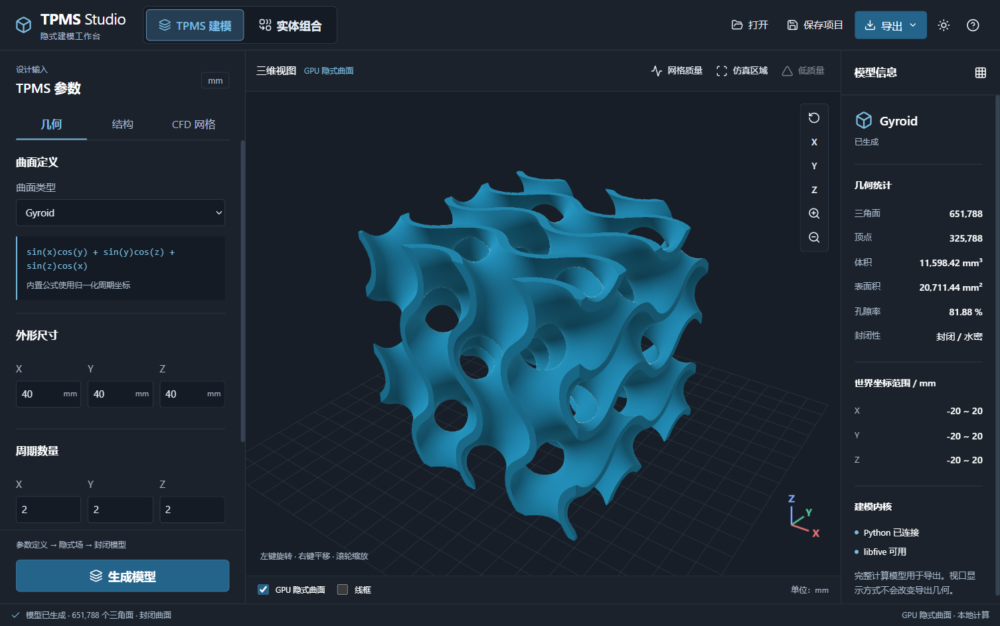
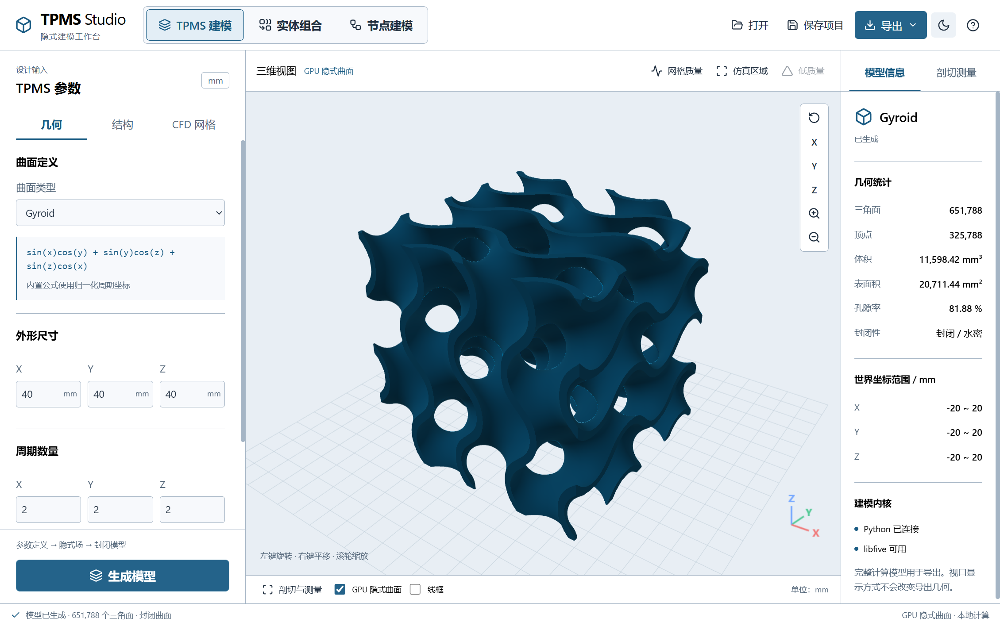
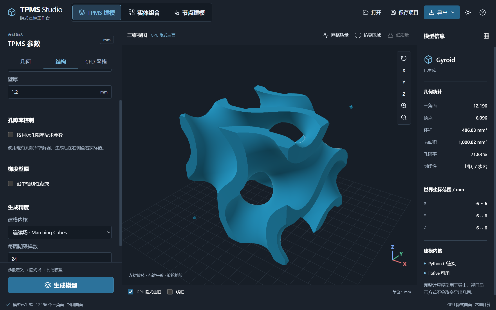
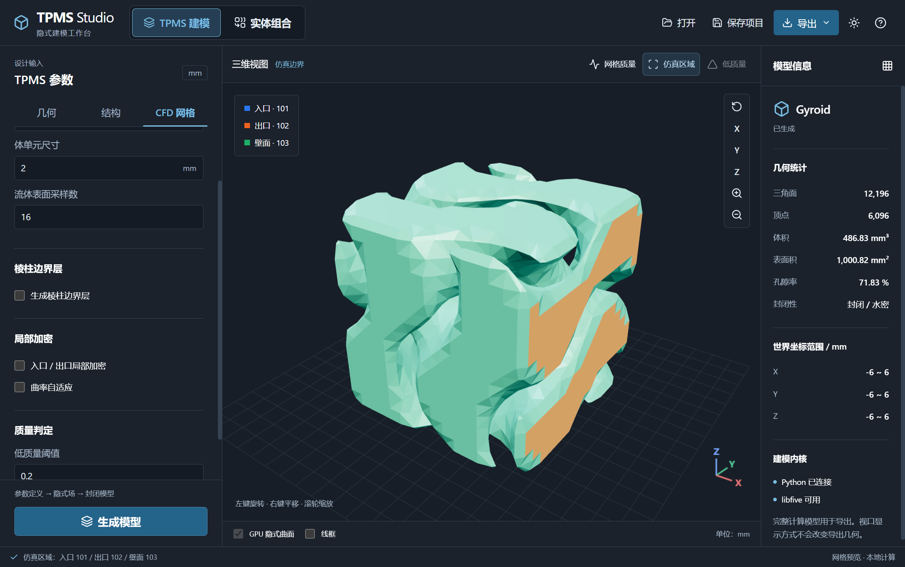
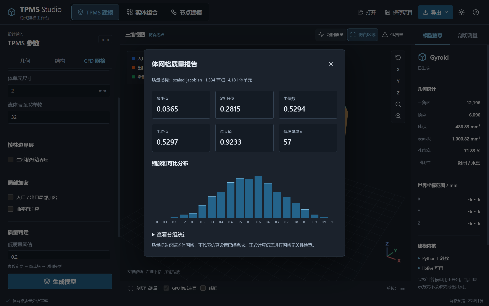
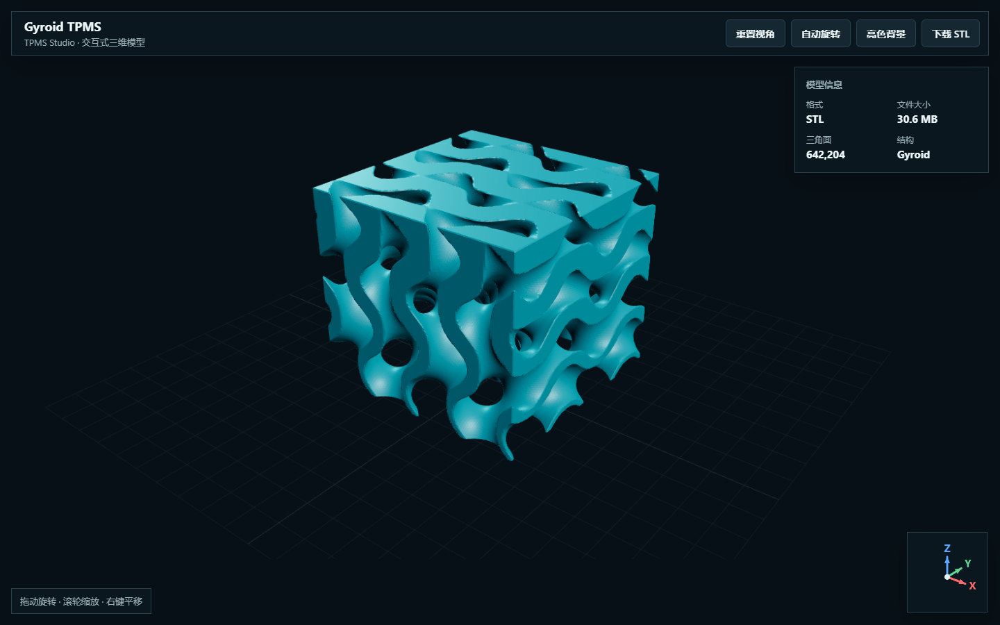

# TPMS Studio

TPMS Studio 是一个本地运行的 TPMS 参数化建模桌面工具，可生成封闭表面模型，并为 COMSOL 流体仿真准备带边界分组和质量数据的体网格。

支持 **Gyroid、Diamond、Primitive、I-WP、Neovius** 五种 TPMS 曲面，以及片层结构、实体结构和目标孔隙率控制。

[版本更新](CHANGELOG.md) · [开发记录、技术决策与已知限制](DEVELOPMENT_LOG.md)

## Electron 工程工作台

新版桌面界面采用 **Electron + React + Three.js/WebGL**，通过独立 Python 进程复用现有 TPMS、libfive 和 CFD 建模能力。默认启动入口为 `run_tpms.bat` 或 `启动Electron.cmd`；`python app.py` / `run_qt.bat` 仍可运行原 Qt 版本。



| 区域 | 使用方式 |
| --- | --- |
| 顶部工作栏 | 切换 TPMS 建模 / 实体组合 / 节点建模；打开、保存可编辑 JSON 项目；在“导出”下拉中设置质量、目标面数或 libfive 网格尺寸，导出 STL/OBJ/PLY 和 COMSOL 体网格 |
| 左侧参数栏 | 几何、结构、CFD 网格分别分组；自定义公式隐藏周期设置；壁厚、孔隙率、梯度、卷绕及建模精度可直接编辑，生成按钮固定在底部 |
| 中央三维视图 | 拖动旋转、右键平移、滚轮缩放；右侧按钮提供 XYZ 轴向视角、重置、放大和缩小；方向标随相机旋转 |
| 右侧属性与模型信息 | 节点模式编辑当前选中步骤或设计参数；模型信息显示生成快照的面数、顶点、体积、面积、孔隙率、水密性和世界坐标范围，以及 Python/libfive 状态 |
| 实体组合 | 对象树、基本体属性、平移旋转、复制、依赖保护删除、布尔组合、融合、最终输出和三个示例 |
| 诊断与反馈 | 仿真边界颜色图例、真实体网格质量报告、低质量单元定位；计算可取消，进度与错误显示在当前界面 |

点击右上角太阳 / 月亮切换整套明暗主题。参数修改后显示“上次生成的模型”，导出与诊断等待重新生成，避免把旧模型误认为新参数的结果。



安装、工程结构及验证命令见 [Electron 开发说明](docs/electron.md)。运行需要 Python/Node.js 环境，尚未打包为独立安装程序。

## 核心功能

| 功能模块 | 主要能力 |
| --- | --- |
| TPMS 参数化建模 | 支持五种典型曲面、片层/实体结构、三轴尺寸、周期数量、壁厚和等值面偏移控制 |
| 数学公式组合 | 支持自定义隐式函数，以及 `min/max` 并集、交集和差集组合 |
| 孔隙率设计 | 按目标孔隙率自动反求片层壁厚或实体等值面偏移，并显示实际孔隙率和误差 |
| 高精度模型生成 | 使用连续隐式距离场提取等值面，封闭六个外边界并自动清理游离碎片 |
| GPU 三维预览 | Three.js/WebGL2 混合隐式预览与网格显示，支持 XYZ 方向标、轴向视角、重置和明暗主题 |
| 剖切与测量 | XYZ/任意法向剖切、材料截面填充与面积/轮廓统计、完整包围盒尺寸、表面选点和坐标输入两点距离 |
| 表面模型导出 | 输出 STL、OBJ、PLY，可用于切片、打印及后续几何处理 |
| libfive 隐式内核 | 可选数学表达式树与自适应 Dual Contouring 表面导出，支持 TPMS、公式布尔组合和梯度壁厚 |
| 实体与组合建模 | 新工作区添加球/盒/圆柱/圆环/TPMS，编辑平移旋转，执行并集/交集/差集/平滑融合，保存可编辑项目 |
| 节点式参数化建模 | 步骤列表与选中属性编辑、数值/公式/向量参数、类型化引用、独立变换、中间预览、依赖更新与缓存、可选自动更新、撤销重做和 JSON 项目 |
| CFD 体网格 | 自动构造孔隙流体域和入口/出口/壁面分组，生成棱柱边界层与四面体核心网格 |
| 网格自适应 | 支持入口/出口局部加密、曲率自适应以及边界层首层高度、层数和增长率控制 |
| 质量分析 | 模型生成后即可按需计算缩放雅可比直方图、低质量单元定位、质量统计和 VTU 完整质量场 |
| 仿真区域可视化 | 模型生成后即可按入口、出口和壁面着色显示，并提供颜色图例 |

## 新界面操作说明

以下截图展示当前 Electron 工作台的实际界面。TPMS 模式采用“左侧参数 + 中央视口 + 右侧模型信息”布局；节点模式采用“左侧步骤列表 + 中央视口 + 右侧选中属性”布局。正文基准 16px，长内容独立滚动，生成按钮保持可见。

### 几何与结构参数

“几何”页选择曲面、外形尺寸和周期数。选择“自定义公式”后显示公式编辑框，并隐藏不适用的周期控件。“结构”页设置片层/实体、壁厚或等值面偏移、目标孔隙率、梯度壁厚和生成精度；还可以设置管状卷绕。目标孔隙率与梯度壁厚互斥，实体模式不使用梯度壁厚。



向下滚动到“生成精度”，选择连续场 Marching Cubes 或可用的 libfive Dual Contouring。每周期采样数影响规则网格精度；libfive 网格尺寸控制自适应提取尺度。二者都不能直接保证某个目标三角面数，详细设置见 [libfive 说明](docs/libfive.md)。

点击“生成模型”后，右侧显示当前完整模型的三角面数、顶点、体积、表面积、孔隙率、水密性和世界坐标范围。底部“GPU 隐式曲面”控制内置 TPMS 的混合隐式预览；自定义公式、卷绕、实体组合和诊断视图使用网格预览。视口右下角的红 X、绿 Y、蓝 Z 随相机旋转，右侧按钮可切换轴向视角或恢复整体视图。

### 导出质量与文件大小


顶部“导出”下拉集中提供原始精度、高质量（约 70% 面数）、标准（约 40%）、轻量（约 20%）、自定义目标面数。安装原生库且当前为非卷绕 TPMS 时，还提供“libfive · 重算网格精度”和网格尺寸输入。设置完成后点击“导出 STL / OBJ / PLY”，在文件对话框选择格式与保存位置；实际面数和封闭性显示在状态栏。

简化后的面数是近似目标。需要保留薄壁、细孔或用于仿真时，应检查导出的几何与水密性。界面右侧统计对应生成快照，不能视为简化后的导出文件统计。修改参数后须重新生成，才能导出新参数结果。

### 实体与布尔组合


点击顶部“实体组合”进入 libfive 工作区：添加球、盒、圆柱、圆环或 TPMS；在对象树选择对象编辑尺寸、位置和旋转；在“布尔与融合”选择对象 A/B，创建并集、交集、差集或基本体平滑融合。随后选择“最终输出对象”、设置网格尺寸，点击“生成实体”。

截图使用“圆柱 TPMS 减流道”示例，对象树保留交集和差集的依赖关系。还提供“球体减贯穿孔”“双球平滑融合”示例；加载会替换当前对象，请先保存项目。JSON 保存可继续编辑的参数和关系，打开后重新生成。详细说明见 [实体与组合建模](docs/solid-modeling.md)。组合实体当前只支持表面导出，CFD 诊断按钮禁用。

### 节点式参数化工作流


点击顶部“节点建模”，左侧“建模步骤”以简洁列表显示实体和输入关系；选中一步，在右侧“节点属性”编辑尺寸、输入实体和位置，中央视口保留模型。列表使用对象名称展示依赖，最终输出有明确标记；默认只打开选中节点的表单。


需要多个对象联动时，进入左侧“设计参数”添加数值、公式或向量，选择参数后在右侧编辑；引用列表可跳转到使用它的步骤。简单模型直接填写实体尺寸即可。数值字段下拉框引用标量参数，位置/旋转引用向量参数，fx 支持 `radius * 2` 等表达式；旧共享常量保留在折叠区域。

进入“输出设置”选择输出节点与网格尺寸，点击固定在左下方的“生成工作流”；也可以开启同一区域的“自动更新输出”，停止编辑 900 ms 后更新模型。修改参数时受影响步骤标记待更新，未改变的数学场可复用缓存，重复输出可直接复用近期网格。新输出仍需要提取完整表面网格，复杂 TPMS 不会因此变成即时计算。


右侧“预览此步骤”查看中间实体，并切到“模型信息”显示它的统计；选择另一步会返回属性编辑。“返回最终输出”恢复最终模型，导出始终使用成功生成的最终输出。支持复制、依赖删除保护、50 步撤销重做和 JSON 保存恢复。完整操作与缓存范围见 [节点建模说明](docs/node-modeling.md)。当前为步骤列表与属性编辑的引用式工作流，尚未包含自由连线画布、Voronoi 或体网格节点。

### 剖切与测量

生成模型后，点击视口底部“剖切与测量”打开右侧工具。支持 XYZ 和自定义法向平面，数字框或滑块调整位置，切换保留侧，也可仅显示截面。切面材料填充保留孔洞，并显示截面面积与轮廓总长；包围盒显示完整模型的 XYZ 尺寸。


斜截面选择“平面方向 → 自定义法向”，例如输入 `(1, 0, 1)`，得到相对 XY 平面倾斜 45° 的切面。法向自动归一化，随后用“剖切位置 / mm”移动平面；“居中”使它通过完整模型包围盒中心。“正对截面”调整观察方向，“仅显示截面”隐藏剩余模型，便于检查材料与孔道分布。


点击“开始两点测量”，在模型可见表面或已填充切面单击 A、B，查看坐标、直线距离和三轴差值；也可手动输入坐标。拖动仍旋转，Esc 结束选点。剖切与测量只改变查看状态，导出保持完整模型。操作与精度范围见 [剖切与测量指南](docs/inspection.md)。


### CFD 参数与仿真区域



“CFD 网格”页设置流动方向、体单元尺寸、流体表面采样数、棱柱边界层、入口/出口局部加密、曲率自适应和低质量阈值。流向负端面是入口，正端面是出口。参数只影响流体网格，不改变已生成的 TPMS 固体。

生成普通 TPMS 后点击视口顶部“仿真区域”，后台构造流体边界，蓝色入口 101、橙色出口 102、绿色壁面 103 的图例显示在视口左上方。再次点击恢复固体预览。截图采用 12mm、单周期 Gyroid、每周期 32 点的流体表面，展示的是离散流体边界。

### 体网格质量



首次点击“网格质量”会生成临时 CFD 体网格，并打开缩放雅可比统计和直方图；不会覆盖正式导出文件。有质量结果后，“低质量”可定位低于阈值的单元。报告显示当前网格的节点数、体单元数和低质量单元数量，截图仅用于说明操作。正式仿真应调整网格并做网格无关性检查。

确认参数后，从顶部“导出”选择“导出 COMSOL 体网格”，保存 BDF、MSH、边界 JSON 和质量 VTU。当前 Electron 在独立 Python 进程中串行计算，支持进度和取消；取消后需重新生成模型。

### 在线三维模型

[](https://starlre.github.io/TPMS-Studio/)

点击上图在 GitHub Pages 加载 `gyroid_tpms.stl`，支持旋转、缩放、平移、自动旋转、重置、背景切换和下载。模型约 `30.6 MB`，首次加载显示进度；右下角 XYZ 方向标随视角同步更新。此网页查看器与本地 Electron 建模程序分别运行。

## 快速开始

### 1. 获取项目

```powershell
git clone --branch 新增建模功能 https://github.com/Starlre/TPMS-Studio.git
cd TPMS-Studio
```

### 2. 安装依赖

建议使用独立的 Python 虚拟环境：

```powershell
python -m venv .venv
.\.venv\Scripts\Activate.ps1
python -m pip install -r requirements.txt
```

主要依赖包括 PyQt5、NumPy、scikit-image、trimesh、Gmsh 和 meshio。

Electron 版本另外需要 **Node.js 22.12+（建议 24 LTS）**；界面依赖在首次启动时按锁文件安装。libfive 实体组合需要按 [内核说明](docs/libfive.md) 配置原生库。

### 3. 运行软件

```powershell
python launch_desktop.py
```

Windows 用户也可以直接双击 `run_tpms.bat` 或 `启动Electron.cmd`。首次安装需要网络。旧版界面使用 `python app.py` 或 `run_qt.bat`。

`launch_desktop.py` 位于项目根目录。建议在终端运行或双击启动脚本；VS Code Code Runner 会一直等待桌面程序退出，重复运行可能提示 `Code is already running!`，此时可直接使用已打开的窗口。

## TPMS 建模

1. 选择 TPMS 类型和片层/实体结构。
2. 设置 X、Y、Z 外形尺寸和各方向周期数量。
3. 设置目标壁厚或等值面偏移，并选择网格精度。
4. 如需指定孔隙率，启用“按目标孔隙率自动求解”并输入目标值。
5. 点击“生成模型”，在三维视口检查结果。
6. 打开顶部“导出”设置质量，点击“导出 STL / OBJ / PLY”保存。

### 主要参数

| 参数 | 作用 |
| --- | --- |
| TPMS 类型 | 选择 Gyroid、Diamond、Primitive、I-WP 或 Neovius |
| 片层结构 | 以目标壁厚构造隐式曲面的双侧壳体 |
| 实体结构 | 保留隐式函数一侧，使用等值面偏移控制材料占比 |
| 外形尺寸 | 设置最终模型在 X、Y、Z 方向的尺寸，单位为 mm |
| 周期数量 | 设置三个方向内的完整 TPMS 周期数 |
| 网格精度 | 设置每个周期的采样点数；越高越光滑，但内存与计算时间也越高 |
| 目标孔隙率 | 自动反求壁厚或等值面偏移，并显示实际孔隙率和求解误差 |

默认建模精度为每周期 64 点。软件使用连续隐式距离场直接提取等值面，以保留亚体素曲率，并在六个外边界自动封闭模型。

### 自定义数学公式

将 TPMS 类型切换为“自定义公式”后，可以用数学表达式定义实体。`x、y、z` 是以模型中心为原点的毫米坐标；内置 TPMS 别名为 `gyroid`、`diamond`、`primitive`、`i_wp` 和 `neovius`。

自定义公式模式会隐藏不适用的周期数量设置，尺寸、结构模式、壁厚/等值面偏移、网格精度和孔隙率等通用参数仍然保留。

支持 `sin`、`cos`、`tan`、`sqrt`、`abs`、`exp`、`log`、加减乘除和幂运算。隐式场约定为 `F <= 0` 的区域：

```text
球体：sqrt(x*x + y*y + z*z) - 10
两个球体并集：min(sqrt(x*x + y*y + z*z) - 10, sqrt((x-12)*(x-12) + y*y + z*z) - 6)
两个球体交集：max(sqrt(x*x + y*y + z*z) - 10, sqrt((x-12)*(x-12) + y*y + z*z) - 6)
球体差去圆柱：max(sqrt(x*x + y*y + z*z) - 10, -(sqrt(x*x + y*y) - 4))
TPMS 与球体并集：min(gyroid, sqrt(x*x + y*y + z*z) - 12)
```

公式由安全解析器执行，不会执行任意 Python 代码。默认经规则采样和 Marching Cubes 输出三角网格，也可选择可用的 libfive 内核；当前不输出精确 STEP/B-Rep 几何。

## COMSOL 流体体网格

### 导出流程

1. 先生成 TPMS 模型。
2. 设置流动方向、体单元尺寸和流体表面精度。
3. 按需要启用棱柱边界层、入口/出口局部加密和曲率自适应。
4. 模型生成完成后可以直接点击“网格质量”预览统计和直方图；首次查看会后台生成临时 CFD 体网格质量数据。
5. 确认参数后在顶部“导出”中点击“导出 COMSOL 体网格”并选择输出位置，再使用“低质量”在视口中定位问题区域。
6. 在 COMSOL 的“网格”节点中添加“导入”，选择 `.bdf` 文件，并将长度单位按 **mm** 解释。

### CFD 网格参数

| 参数 | 默认值 | 说明 |
| --- | ---: | --- |
| 流动方向 | X | 负方向端面为入口，正方向端面为出口 |
| 体单元尺寸 | 1.5 mm | Gmsh 的全局目标最大尺寸 |
| 流体表面精度 | 32 | 每个 TPMS 周期的流体边界采样点数 |
| 边界层层数 | 3 | 启用后生成的棱柱层数量 |
| 首层高度 | 0.05 mm | 第一层棱柱的目标厚度 |
| 增长率 | 1.2 | 后续棱柱层厚度的增长系数 |
| 入出口局部加密 | 开启 | 在入口和出口附近减小单元尺寸 |
| 曲率自适应 | 开启 | 根据局部曲率调整网格尺寸 |
| 低质量阈值 | 0.20 | 缩放雅可比低于该值的单元会被统计和定位 |

如果高曲率或狭窄孔道中的边界层发生自交，软件会停止导出并提示减小首层高度、层数或增长率。

### 输出文件

| 文件 | 用途 |
| --- | --- |
| `.bdf` | NASTRAN 网格，供 COMSOL 网格导入；可包含 `CTETRA` 和 `CPENTA` |
| `.msh` | Gmsh 2.2 网格，便于其他网格工具读取和检查 |
| `_boundaries.json` | 边界编号、网格数量、参数、质量统计和文件路径 |
| `_quality.vtu` | 每个四面体/棱柱单元的 `scaled_jacobian` 质量场，可在 ParaView 中查看 |

物理分组编号：

| 编号 | 分组 |
| ---: | --- |
| 101 | 入口 |
| 102 | 出口 |
| 103 | 壁面 |
| 201 | 流体域 |

片层 TPMS 可能形成两个互不连通的流体网络。软件会分别划分每个封闭流体域，再将其合并到同一份输出网格。

## 网格质量

模型生成后即可打开质量报告。首次打开会在系统临时目录生成用于分析的 CFD 体网格，不会覆盖正式导出文件；正式网格仍需点击“导出 COMSOL 体网格”保存。Electron 报告显示缩放雅可比最小值、最大值、5% 分位数、中位数、平均值、直方图和低质量单元数量；输出 JSON 还包含最小单元体积和最大边长比等统计。`_quality.vtu` 保存完整质量场，正式仿真前请结合低质量定位调整参数，并完成网格无关性检查。

## 已知限制

- 当前输出的是三角表面网格和 CFD 体网格，不是 STEP/Parasolid 等 B-Rep 几何。
- 棱柱边界层当前覆盖流体域全部封闭边界，包括 TPMS 壁面、入口和出口。
- 导出体网格不会自动创建 COMSOL 材料、物理场、边界条件或求解器。
- MSH/BDF 已通过自动化格式回读验证，尚未完成 COMSOL 导入验收。
- 高精度、大周期数量和较小单元尺寸会显著增加内存占用与生成时间。

## 测试

```powershell
python -m pytest -q
```

当前自动化测试覆盖 TPMS 网格生成、孔隙率求解、碎片清理、流体网格分组、混合棱柱/四面体 BDF 和 VTU 质量场。
