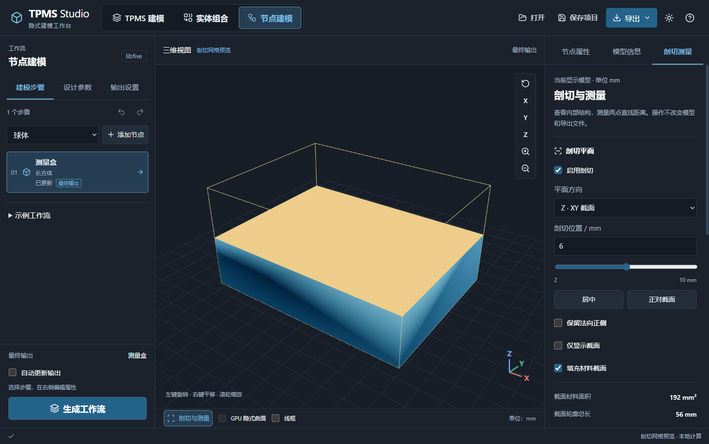
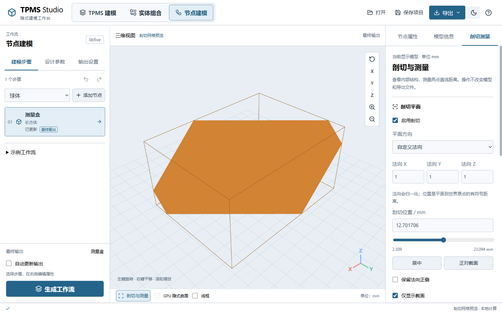
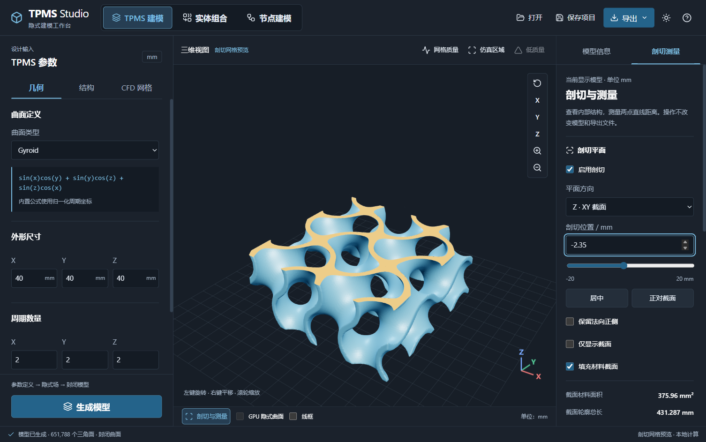
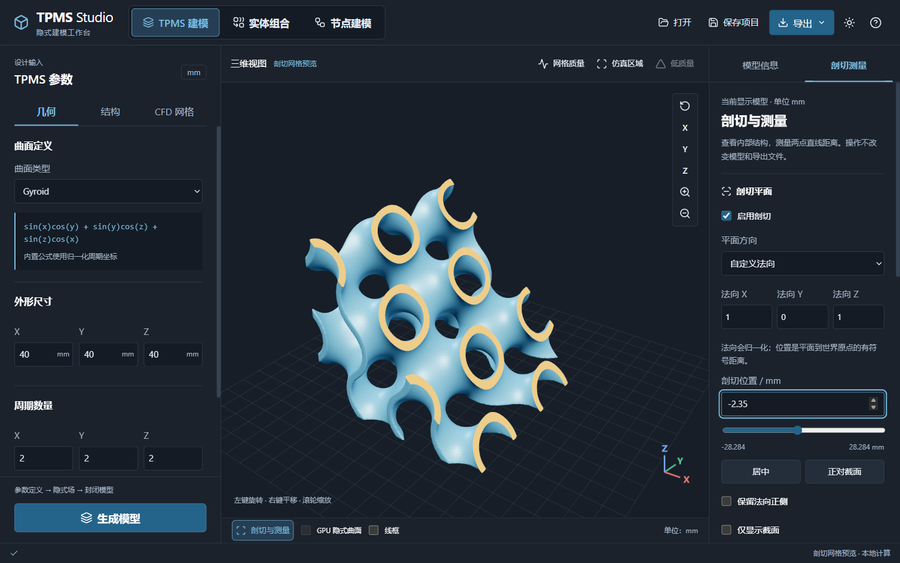
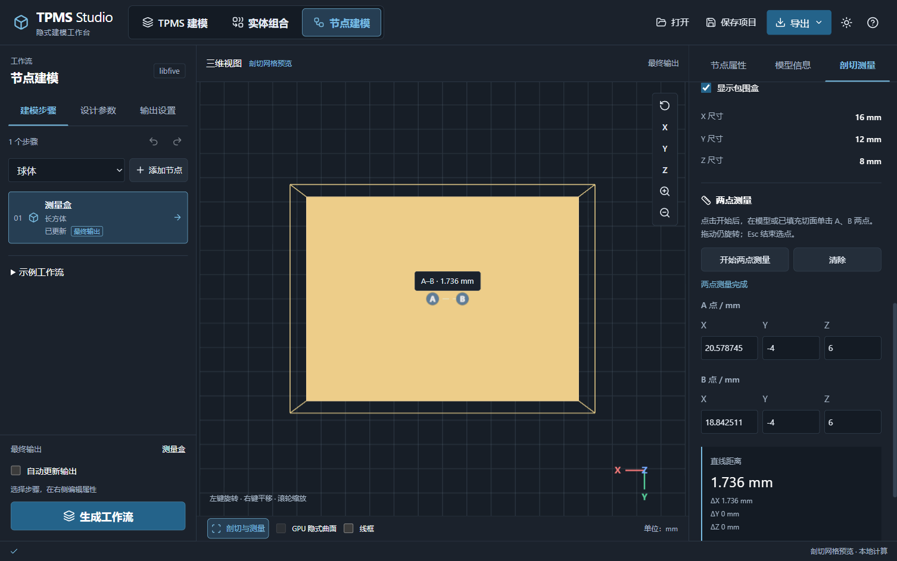

# 剖切与测量

Electron 工作台提供显示级剖切、截面统计、包围盒和两点测量。适用于普通 TPMS、实体组合、节点最终输出、中间节点预览及诊断边界。当前查看操作不修改建模参数、最终输出节点或 STL/OBJ/PLY 导出几何。

## 打开工具

生成模型后，点击视口底部 **剖切与测量**，或右侧检查器的 **剖切测量** 页签。控件在右侧独立滚动，中央视口仍可旋转和缩放；节点属性与模型信息保留在相邻页签。

## 剖切平面

勾选 **启用剖切**，选择方向，再用 **剖切位置 / mm** 数字框或滑块移动平面。数字框可键盘输入，滑块可使用方向键调整。

| 方向 | 平面定义 |
| --- | --- |
| X · YZ 截面 | 世界坐标 `x = 剖切位置` |
| Y · XZ 截面 | 世界坐标 `y = 剖切位置` |
| Z · XY 截面 | 世界坐标 `z = 剖切位置` |
| 自定义法向 | `n·p = 剖切位置`，输入法向向量后自动归一化 |

自定义法向例如 `(1, 1, 1)` 可观察倾斜截面。位置是平面到世界原点的有符号距离，使用模型世界坐标；不是沿某个坐标轴的位移。法向不能为零。切换方向自动将平面移到包围盒中心；**居中** 可恢复中心位置。

默认保留 `n·p ≤ 剖切位置` 的一侧，勾选 **保留法向正侧** 后保留另一侧。**正对截面** 调整相机观察方向，仍使用透视相机。**仅显示截面** 隐藏其余模型，便于检查平面材料分布。



**填充材料截面** 将切开的材料部分着色，孔隙保持空白；取消后保留轮廓线。后台通过当前显示网格的三角面与平面求交、闭合轮廓嵌套和带孔三角化生成显示切面。面板显示截面材料面积（mm²）、所有轮廓的总长（mm）和闭合轮廓数量。



切面位置更新时先刷新 GPU 裁剪，停止编辑 180 ms 后请求后台轮廓计算。过期结果会被丢弃；计算期间视口可操作。剖切使用网格显示，关闭工具作用后可恢复原先的 GPU 隐式预览偏好。



## 斜截面示例

要观察 TPMS 的倾斜孔道，可按以下步骤设置：

1. 生成模型，打开 **剖切与测量**，勾选 **启用剖切**。
2. 将 **平面方向** 改为 **自定义法向**，分别输入法向 X=`1`、Y=`0`、Z=`1`。这会得到相对 XY 平面倾斜 45° 的切面。
3. 设置 **剖切位置 / mm**，或点击 **居中** 后拖动滑块；下图使用 `-2.35 mm`。编辑法向会重新居中，因此应先确定方向，再调整位置。
4. 保持 **填充材料截面** 开启，观察橙色材料切面与空白孔洞。需要查看另一半时勾选 **保留法向正侧**；需要平面视图时点击 **正对截面**，再勾选 **仅显示截面**。



| 输入法向 | 切面方向 | 位置为 0 时的平面 |
| --- | --- | --- |
| `(0, 0, 1)` | 平行 XY 平面 | `z = 0` |
| `(1, 0, 1)` | 相对 XY 平面倾斜 45°，绕 Y 方向 | `x + z = 0` |
| `(1, 1, 1)` | 法向与三个正坐标轴等角 | `x + y + z = 0` |
| `(sin θ, 0, cos θ)` | 相对 XY 平面绕 Y 方向倾斜 θ | `x sin θ + z cos θ = 0` |

最后一行是计算法向的方法，输入框需填计算后的数值。例如 30° 可输入 `(0.5, 0, 0.8660254)`，不直接输入三角函数表达式。

平面方程始终为 `n·p = offset`，其中 `n` 是归一化后的法向。输入 `(1, 0, 1)` 时，方程是 `(x + z) / √2 = offset`；`offset` 是沿单位法向的有符号距离，不是 X 或 Z 坐标。若包围盒中心为 `c`，居中位置为 `n·c`；经过平移的模型不一定在位置 0 处居中。

斜截面属于查看工具，STL/OBJ/PLY 仍导出完整模型。若要导出切开的实体，应在实体组合或节点工作流中用基本体进行布尔交集或差集。

## 外形尺寸

**显示包围盒** 在视口标记当前显示网格的完整世界坐标包围盒。面板中的 X/Y/Z 尺寸分别为 `最大坐标 − 最小坐标`。

这些尺寸始终对应完整显示模型，不是剖切后剩余部分的尺寸，也不等于最小定向包围盒。中间节点或诊断边界显示时，尺寸随当前网格改变。

仿真区域显示时，填充及面积对应流体域，标签显示“流体截面”；低质量定位时对应显示的单元，不能当作整个材料或流体域的截面统计。

## 两点测量

1. 点击 **开始两点测量**，依次在模型可见表面或已填充切面上单击 A、B 两点。
2. 视口显示 A/B 标记、连接线和直线距离；右侧显示两点世界坐标、距离及 `ΔX/ΔY/ΔZ` 的绝对值。
3. 拖动仍旋转模型，不会误记录测量点；右键平移、滚轮缩放不变。`Esc` 或 **结束选点** 停止选点。
4. 可直接编辑 A/B 的 XYZ 坐标，定义空间任意两点。例如 A=(0,0,0)、B=(3,4,12) 的直线距离为 13 mm。
5. **清除** 移除测量点；再次开始会清空上一组测量。



选点计算在后台执行，过滤被剖掉的表面。仅显示截面时只能拾取已填充的材料切面；点击空白或孔隙会提示未选中表面。测量显示采用当前网格，暂时关闭隐式叠加，保证选点与显示几何一致。鼠标选取坐标保留六位小数，距离显示三位小数；显示位数不代表实际几何精度。

## 恢复与限制

- **恢复完整模型并清除测量** 关闭剖切与包围盒，并移除测量点。
- 修改剖切平面、保留侧、填充或截面显示方式会清除旧测量；切换显示网格、重新生成或进入另一节点预览会重置剖切和测量。
- 关闭检查器页签不关闭已启用的剖切。查看旧生成快照时，测量也对应旧模型，视口继续显示快照提示。
- 剖切设置和测量点是查看状态，当前不保存到项目 JSON；不支持将剖切剩余部分或截面直接导出为新实体。
- 测量是两点欧氏距离，不是自动壁厚、孔径、最短表面距离或沿面距离；任意手动坐标也不要求落在模型表面。
- 截面统计基于离散网格。开放或分叉轮廓只显示线，不填充、不估算面积；没有交线时面积为零。截面超过 20 万线段时显示部分轮廓并明确提示，不给出完整面积。
- 切面可能出现多个不连通区域；孔洞按轮廓嵌套保留。薄壁、细孔与极端位置需要足够的建模精度。
- 当前只在 Electron 工作台提供，Qt 兼容入口未加入此工具。

## 实现与验证

`InspectionPanel.jsx` 管理检查器控件，`Viewport.jsx` 管理实时裁剪和标记，`inspection.worker.js` 在后台处理截面与选点，`inspection_math.mjs` 实现网格求交、轮廓、带孔填充和距离计算。

```powershell
cd desktop
npm test
npm run build
npm run verify-inspection
```

几何测试覆盖平移模型、任意方向平面、闭合轮廓与孔洞、开放轮廓、边界/空截面、正负保留侧与零法向保护。实际窗口验收覆盖表面选点、手动 13 mm 距离、拖动/Esc、主题、1120×760 布局、模型重置、TPMS 隐式预览恢复及 CFD 边界；剖切前后原始 STL 内容保持一致。
