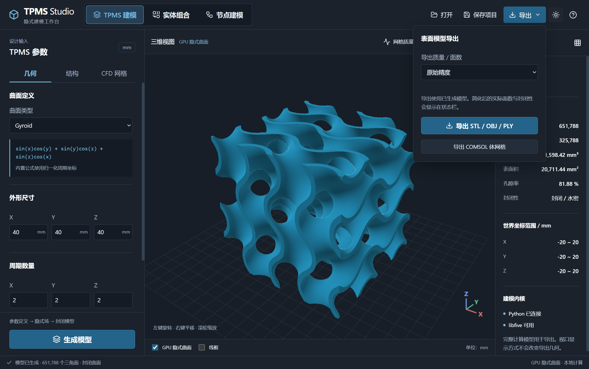

# libfive 隐式建模内核

libfive 提供数学表达式树与自适应 Dual Contouring 表面网格生成，接入 TPMS 建模和实体组合工作区。使用官方 C API，当前固定源码版本为 `c9e97343e0af998cd1696e85583eccba95532b96`，没有安装 PyPI 上名字相近的包。

## 使用

当前 Electron 支持两种 TPMS 用法：

1. **生成时使用**：左侧“结构”页滚动到“生成精度”，将“建模内核”设为“libfive · Dual Contouring”，设置“libfive 网格尺寸”（mm）后点击“生成模型”。
2. **导出时重算**：先生成 TPMS，再打开顶部“导出”，将“导出质量 / 面数”设为“libfive · 重算网格精度”，设置“网格尺寸”，点击“导出 STL / OBJ / PLY”。



截图展示菜单默认的“原始精度”；需要在下拉列表中切换到 libfive 才显示网格尺寸输入。该选项只在原生库可用且生成结果为非卷绕 TPMS 时提供。

“实体组合”工作区始终使用 libfive，精度在左侧“输出与精度”中设置；默认导出当前已生成的组合网格，操作见 [实体建模说明](solid-modeling.md)。Qt 兼容版本保留原“导出模型 / 导出内核”入口。

网格尺寸越小，细节越多、耗时和内存也越大。默认值根据模型采样间距和最小壁厚计算。该值是八叉树最小划分尺度，不是最大表面误差保证，也不是目标三角面数。libfive 模式暂停使用原来的面数简化选项，状态栏显示实际导出面数和文件大小。失败会显示原因，不会将其他内核输出冒充 libfive 结果。

生成过程中预览仍可旋转，其他建模/导出操作暂时禁用；后台任务完成后恢复。Electron 使用独立 Python 工作进程，可取消计算；取消会重启后端，需重新生成模型。

## 支持范围

| 项目 | 本阶段行为 |
| --- | --- |
| Gyroid、Diamond、Primitive、I-WP、Neovius | 片层与实体，三轴尺寸和周期数 |
| 自定义公式 | 沿用原有受限 AST 语法，物理坐标 `x/y/z` 为 mm，内置曲面别名为周期相位场 |
| 数学函数组合 | `sin/cos/tan/sqrt/abs/exp/log/min/max`，四则运算与常数指数；支持球/圆柱/盒等公式布尔组合 |
| 梯度壁厚 | X/Y/Z 线性变化，保持现有梯度方向约定 |
| 孔隙率 | 使用现有采样反求结果的壁厚/等值面；导出不重复求解，实际孔隙率可能有离散误差 |
| 裁剪与碎片清理 | 六面盒裁剪，沿用微小分量清理，导出前检查水密性、朝向与正体积 |
| 管状卷绕 | 本阶段明确拒绝，继续选择“现有网格”导出 |
| GPU 预览、CFD/COMSOL 体网格 | 预览与表面内核独立；CFD 沿用已有 Gmsh 实现，组合实体暂不支持 CFD |

[实体与组合建模工作区](solid-modeling.md) 提供基本体、变换与组合控件，不需要编写公式也能建模。[节点建模工作区](node-modeling.md) 进一步提供步骤列表、选中属性编辑、数值/公式/向量参数、上游引用和中间预览。自由连线画布、STEP/B-Rep 或新体网格算法尚未包含。

## 数学定义与实现

材料采用负值在实体内部的约定。内置 TPMS 的坐标相位仍是 `2*pi*cells*(coord/size+0.5)`。片层保持现有的 `abs(F)/max(norm(gradient(F)),1e-6)-thickness/2` 零等值面，梯度使用现有采样间距的中心差分表达式。为避免区间计算除零，libfive 表达式实际使用等价的 `abs(F)-thickness/2*max(norm(gradient(F)),1e-6)`。这是原有壁厚距离近似，并非严格的等距偏置曲面。

实体使用 `iso_level-F`，与现有归一化表达式有相同的符号和零等值面。裁剪使用 `max(material, abs(x)-Lx/2, abs(y)-Ly/2, abs(z)-Lz/2)`。网格提取区域在盒外留余量，从而提取封闭的边界盖面。

直接从参数调用 `generate_libfive_mesh()` 时可运行已有孔隙率求解器；导出重算复用生成快照中的已求解参数（Qt 经 `export_libfive_mesh(current_result, ...)`，Electron 经独立后端调度）。两种提取算法的三角面、边界插值与体积会存在差异，界面统计对应当前生成网格。

libfive C API 实现中的 `res` 实际设定 `min_feature=1/res`，适配器传入 `1/cell_size`。原生网格数组复制后立即释放，表达式树通过显式资源上下文释放。DLL 延迟加载，未安装时仍能使用连续场内核。原生提取使用单线程 FFI 入口；Electron 在独立 Python 进程执行，Qt 兼容版本在工作线程执行，避免阻塞窗口。

## Windows 安装与构建

Windows 构建脚本采用 MSYS2 UCRT64 GCC x64 工具链。先在 UCRT64 终端安装工具：

```bash
pacman -S --needed mingw-w64-ucrt-x86_64-gcc mingw-w64-ucrt-x86_64-cmake mingw-w64-ucrt-x86_64-ninja mingw-w64-ucrt-x86_64-boost mingw-w64-ucrt-x86_64-libpng mingw-w64-ucrt-x86_64-pkgconf
```

在项目根目录运行：

安装或更新 DLL 前请关闭正在运行的 TPMS Studio，Windows 不能覆盖已加载的 DLL。

```powershell
powershell -ExecutionPolicy Bypass -File .\scripts\build_libfive.ps1
```

脚本固定官方源码版本并单独获取 Eigen 3.4.0（验证 SHA256），仅编译内核，复制 DLL、依赖及许可证到 `native/libfive/`。构建不使用不兼容的 Eigen 5。可用 `-MsysRoot` 指定 MSYS2 安装目录、`-BuildRoot` 指定仅含 ASCII 字符的构建目录、`-Jobs` 设置并行任务数。不修改系统 PATH，环境变量在脚本结束时恢复。已有不同版本或改动的源码目录会被保留并报错，此时请指定新的构建目录。

Python 和 DLL 必须同为 64 位。软件从自身目录定位 DLL，与启动工作目录无关；也支持指定现成库：

```powershell
$env:TPMS_LIBFIVE_LIBRARY = (Resolve-Path '.\native\libfive\libfive.dll').Path
python launch_desktop.py
```

`native/libfive/` 中的二进制构建产物不纳入 Git；安装时需要运行构建脚本或提供匹配的原生库。Linux/macOS 可编译官方内核后使用同一环境变量，当前尚未完成平台验收。

也支持便携布局：将 `libfive.dll` 和同版本依赖 DLL 一起放在项目根目录。查找顺序为环境变量指定路径、`native/libfive/`、项目根目录；不会修改系统 PATH。根目录 DLL 同样由 Git 忽略。第三方许可证必须随程序保留。

## 限制与验证

- 极薄壁、极高频公式或狭窄特征可能在较粗网格中消失。内置模型会检查最小壁厚/周期约束；任意自定义公式仍需用户做精度收敛检查。
- 预设八叉树潜在叶节点预算为 1677 万，限制过度细化。实际性能取决于公式复杂度、区间剪枝和表面特征。
- 表面网格封闭性检查不能代替自交检查或仿真网格质量验证；建议高/低两档精度比对体积、孔隙率和关键尺寸。
- 自定义公式必须在区域内有实数定义，`log/sqrt/除法` 仍需注意定义域。

```powershell
python -m pytest -q
python -m pytest test_libfive_backend.py -q
```

原生测试覆盖五种 TPMS 两种模式、梯度方向、自定义球体与球减圆柱、孔隙率参数复用，以及 STL/OBJ/PLY 文件回读。没有 DLL 时原生测试明确跳过，参数保护及 GUI 状态测试仍执行。

## 第三方许可

libfive 官方内核使用 MPL-2.0，许可证副本位于 `native/MPL-2.0.txt`。源码来源：<https://github.com/libfive/libfive/tree/c9e97343e0af998cd1696e85583eccba95532b96>。本项目没有修改 libfive 官方源码，单独的 `native/CMakeLists.txt` 负责构建配置。分发二进制时保留该许可证、源码获取路径，以及 GCC 运行库例外、libpng、zlib 和 winpthread 的相关许可文件。
