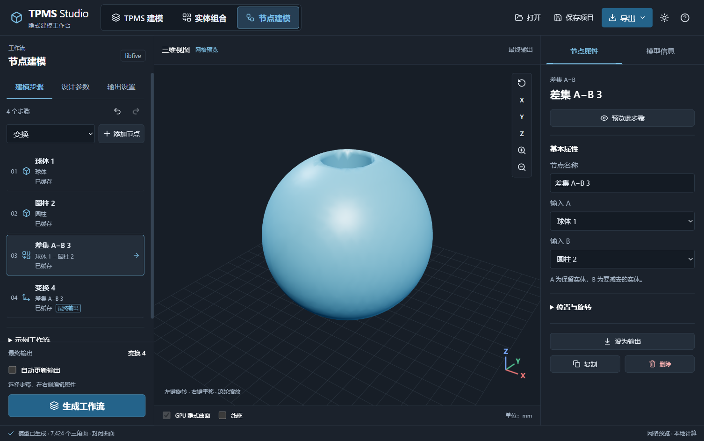
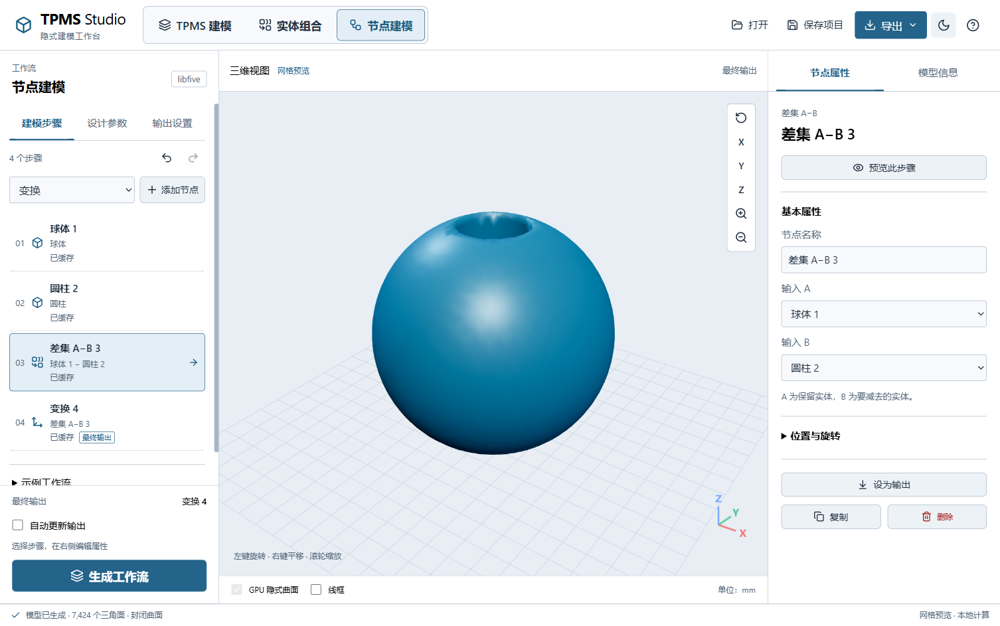
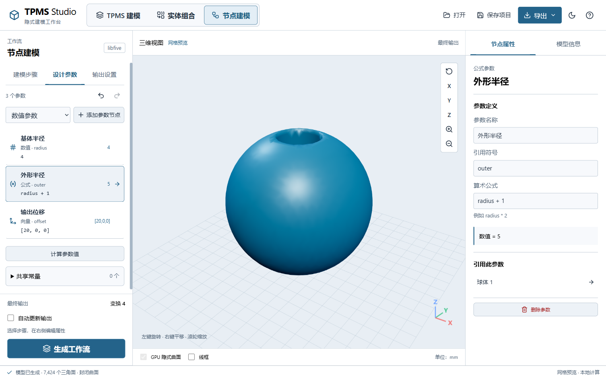
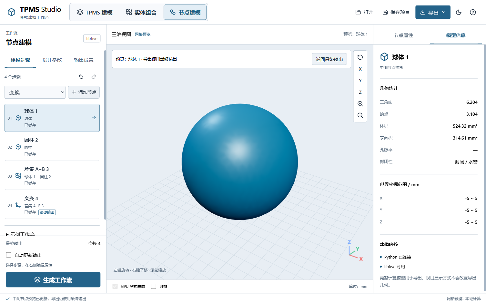

# 节点式参数化建模

更新时间：2026-10-10 12:11:35（Asia/Shanghai），本轮界面更新 R-063。

从项目根目录运行 `python launch_desktop.py`，点击顶部 **节点建模**。工作区采用左侧步骤列表、中央模型预览、右侧选中节点属性，通过上游实体引用构建参数化工作流，使用现有 libfive 隐式建模内核计算最终表面网格。设计参数和输出设置在左侧独立分类，不需要同时滚动所有表单。



## 添加与连接

1. 在“建模步骤”选择基本实体或 TPMS，点击“添加节点”。
2. 新步骤自动选中，在右侧“节点属性”编辑名称、尺寸和位置；TPMS 节点直接设置曲面、周期、结构模式、壁厚、孔隙率、梯度或自定义公式。其他步骤保留简洁列表。
3. 添加并集、交集、差集或平滑融合节点，用“输入 A / B”引用已有实体；差集始终为 A 减 B。
4. 添加“变换”节点，选择一个“输入实体”，设置平移与旋转。上游实体不被改写，同一实体可被多个变换引用。
5. 在右侧点击“设为输出”，或进入左侧“输出设置”并在右侧选择“输出节点”、设置网格尺寸。左下方始终显示最终输出名称、自动更新与“生成工作流”。
6. 生成成功后用顶部“导出”保存 STL、OBJ 或 PLY。

步骤按依赖顺序编号展示，列表以实体名称说明上游输入；序号仅用于显示，实际计算由引用决定。点击列表选中一步，右侧只显示该步骤表单，选择不会更改输出或模型参数。输入列表排除自身与下游，防止循环；后台也会重新校验。输入不完整、A/B 重复或 TPMS 参与平滑融合时，列表和属性显示错误并禁用生成。被引用的实体不能直接删除，需先更换下游输入或删除下游节点。



## 共享参数与表达式

左侧“设计参数”支持三种独立类型，最多 32 个参数；选中一个后，在右侧编辑它的定义。简单模型无需先创建参数，直接填写尺寸即可：

| 类型 | 输入 | 输出/引用方式 |
| --- | --- | --- |
| 数值 | 有限数字，例如 4 | 数值字段下拉框或 fx 引用 `radius` |
| 公式 | 算术表达式，例如 `radius * 2` | 标量符号，例如 `diameter`；可引用其他标量及向量分量 |
| 向量 | XYZ 三个数值或表达式，例如 `diameter + 12, 0, radius` | “位置向量引用”/“旋转向量引用”选择该节点，或在 fx 引用 `offset_x / offset_y / offset_z` |

每个参数块有显示名称和英文引用符号；公式按实际依赖解析，不要求列表顺序。不能将整个向量符号当作一个数字，不能将标量接到向量输入，重复符号、未知变量和参数循环均拒绝。“计算参数值”可在没有几何时检查标量/向量结果。选中向量后手动 XYZ 禁用并清除对应分量表达式；取消引用恢复此前保存的手动数值。

右侧“引用此参数”显示使用者，点击可以跳转到对应参数或建模步骤。参数列表同时显示名称、符号和当前定义/计算结果。



在“设计参数”底部展开“共享常量”仍可添加 `wall`、`radius`、`height` 等旧共享数值。右侧节点数值框旁的 **fx** 切换为表达式输入，可以填写：

```text
半径：radius
高度：height * 2
TPMS 壁厚：wall
X 位置：radius * 3
融合宽度：max(wall * 2, 1)
```

允许 `+ - * / **`、括号、`pi` 和 `abs/min/max/sqrt`。不执行 Python 代码；属性访问、索引、未知变量、除零及非实数结果均拒绝。参数名须为英文标识符，最长 32 字符，最多 32 个参数；`pi/abs/min/max/sqrt` 是保留名称。表达式最长 256 字符，指数绝对值不超过 8，中间结果绝对值不超过 1,000,000；最终数值仍受具体建模参数范围限制。

单位沿用输入项：尺寸/位置/壁厚为 mm，旋转为度，孔隙率为 0–1，周期数和采样数必须得到整数。数值表达式与 TPMS 的 `f(x,y,z)` 曲面公式是两个输入：前者引用共享参数，后者沿用已有空间函数语法。

修改共享参数后，引用它的实体和下游运算在下一次生成中使用新值。切回普通数值时恢复该字段此前保存的数值。参数被表达式引用时禁止删除。TPMS 节点保存自己的参数快照，“使用当前 TPMS 参数”会用普通 TPMS 工作区的设置替换它，并清除该节点的 TPMS 参数绑定。

## 生成、历史与项目

修改后受影响步骤显示“待更新”，视口保留上次成功的最终结果，导出等待重新生成。点击“生成工作流”时解析参数并沿输出依赖编译数学表达式树；只重新编译发生变化的数学场及下游。步骤显示计算数学场、提取网格、数学场已更新或缓存复用，状态文字与颜色同时反馈。未参与当前输出的节点不会主动提取网格。

选中几何步骤后，右侧“预览此步骤”可单独查看球、孔、布尔或变换后的实体，并自动切到“模型信息”显示当前预览统计。选择另一项会切回“节点属性”，也可手动切换两页签。“返回最终输出”恢复已生成最终模型。预览不改变输出节点、不清除参数待更新状态、不替换后端导出快照；最终导出仍使用指定输出。编辑参数会退出中间预览，避免把旧预览误认为新结果。



“自动更新输出”默认关闭。开启后停止编辑 900 ms 自动生成；输入错误或取消后不会自动反复重试相同设置，修正输入后可继续自动更新，也可点击生成重试。计算仍在独立 Python 进程中，期间参数控件禁用，视口可旋转，支持取消。

缓存范围：同一 Python 计算进程内，已解析参数与上游签名决定数学场复用；改名称不重建几何，改网格尺寸会失效。近期完整网格使用 LRU，最多 8 个且顶点/面数组总计不超过 96 MiB；数学场达到 192 条或原生指针超过 250,000 时在下次未命中网格的请求前重置。预算不包含 trimesh 属性缓存与提取网格的峰值内存。取消、重启进程清空缓存，缓存不写入项目 JSON。变化后的输出仍提取完整网格，尚未实现局部网格补丁更新。

工具栏提供节点工作流的撤销/重做（最多 50 步）；非文本编辑状态下也可用 `Ctrl+Z`、`Ctrl+Shift+Z` 或 `Ctrl+Y`。文本框内保留正常的文本撤销。复制保留参数与上游引用，形成可独立调整的新节点。

“保存项目”记录几何节点、数值/公式/向量块、标量表达式、向量引用、共享常量、输出和精度；参数块也参与 50 步撤销重做。只有参数、没有几何的工作区可以保存。“打开”恢复节点工作区，重新生成后得到网格。撤销历史、自动更新开关、属性展开状态和缓存不保存。版本仍为 1，通过可选 `value_nodes` 与 `vector_inputs` 字段兼容旧 JSON；原实体组合与普通 Electron 项目仍可读取。

空工作区可直接加载“圆柱 TPMS 工作流”；有对象时，在底部展开“示例工作流”选择球体贯穿孔、双球融合或圆柱 TPMS 减流道。示例替换当前对象，先保存需要保留的项目。


## 当前范围

- 支持球、盒、圆柱、圆环、五种 TPMS、自定义公式、四种布尔/融合和独立平移旋转节点，最多 64 个实体节点。
- 这是步骤列表与属性编辑的引用式工作流；自由连线画布、拖拽布线和跨文件子工作流尚未提供。
- 参数块目前支持标量与向量；没有 nTop 的空间场、列表、网格类型系统或单位自动换算。参数公式采用有限算术语法，不等于 TPMS 空间函数编辑器。
- 网格导入转隐式、Voronoi 点阵、体网格节点及 STEP/B-Rep 输出尚未加入。节点工作流不等于已经支持截图中 nTop 的所有功能块。
- 组合输出暂不支持 CFD/COMSOL，管状卷绕 TPMS 不支持进入实体图；平滑融合只支持基本体及其组合。
- 空间中的细孔和薄壁仍受 libfive 网格尺寸影响，需要精度收敛检查。错误保留上次模型；取消计算清空后端结果，需要重新生成。
- 使用 Electron 工作台编辑含表达式与变换节点的项目；Qt 兼容版本没有新增的节点编辑界面。

实现：`desktop/src/NodeWorkflow.jsx`、`ValueBlocks.jsx`、`node_graph.mjs`、`parametric.py`、`workflow_values.py`、`workflow_engine.py`、`solid_model.py` 和 `electron_backend.py`。

```powershell
python -m pytest -q
cd desktop
npm run build
npm test
npm run verify-nodes
npm run verify-node-optimization
npm run verify-workflow-layout
```

验证包含真实共享参数联动后的体积/坐标、类型与参数循环防护、旧项目兼容、数学场依赖复用、网格缓存与淘汰、中间预览/最终导出隔离、自动更新错误恢复、真实 Electron 步骤列表、保存恢复、撤销重做及 STL 导出。
