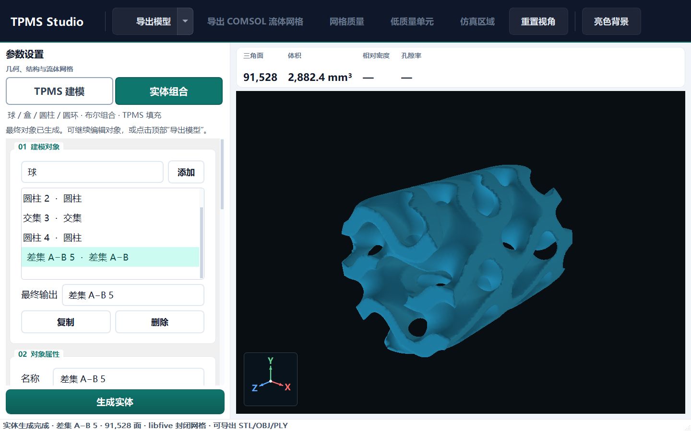

# 实体与组合建模

左侧顶部直接点击 **实体组合** 模式按钮，即可使用新对象编辑器。与“TPMS 建模”按钮并排常显，当前模式以深青色和白色文字突出；下方显示“球 / 盒 / 圆柱 / 圆环 · 布尔组合 · TPMS 填充”。此处生成的模型直接来自 libfive，预览和导出使用同一网格。

## 基本实体

| 对象 | 尺寸参数 | 默认方向 |
| --- | --- | --- |
| 球 | 半径 | 原点为球心 |
| 盒 | X/Y/Z 长度 | 原点为盒中心 |
| 圆柱 | 半径、高度 | 轴向为局部 Z |
| 圆环 | 主半径、管半径 | 环位于局部 XY 平面 |
| TPMS | 从原 TPMS 参数区读取独立参数快照 | 与原三轴定义相同 |

所有对象可设置 XYZ 位置（mm）与 XYZ 旋转（度）。采用绕 X、再 Y、再 Z 的旋转顺序，之后平移。尺寸均为实体本身的尺寸；“位置”不改变尺寸。组合对象也可以整体平移和旋转。

## 操作流程

1. 选择实体类型并点击“添加”。
2. 在对象列表选择对象，编辑尺寸/位置/旋转，点击“应用属性”。
3. 在“实体组合”中选择 A、B 和操作，点击“创建组合”。
4. “最终输出”选择要生成的对象；组合结果也能作为后续组合的 A 或 B。
5. 设置网格尺寸，点击底部“生成实体”。完成后在右侧查看，并从顶部导出 STL/OBJ/PLY。

生成和保存前会自动应用当前对象属性。切换到其他对象前，请先点击“应用属性”；未应用的输入不保存。修改后的预览保留上次生成结果，提示需要重新生成。

| 操作 | 行为 |
| --- | --- |
| 并集 | 合并 A 和 B，可保留多个分离实体 |
| 交集 | 只保留 A 和 B 重叠区域；用圆柱/球/盒裁剪 TPMS 填充区域 |
| 差集 A−B | 从 A 挖去 B；顺序影响结果 |
| 平滑融合 | 按指定 mm 宽度圆滑连接两个基本实体组合 |

球、盒、圆柱、圆环采用距离函数构造。TPMS 场仍沿用原来的距离近似，不能作为精确距离场参与本阶段的平滑融合；该操作会明确拒绝 TPMS 输入，普通并集/交集/差集均支持 TPMS。

## 示例：圆柱内 Gyroid 与流道

在“精度与项目”选择“示例：圆柱 TPMS + 流道”，点击“加载示例（替换当前对象）”，再点击“生成实体”。

对象关系为：24 mm 盒域内的 Gyroid，与半径 10 mm、高 24 mm 的圆柱取交集，再减去半径 3 mm、高 30 mm 的贯穿圆柱。通过对象列表可修改外柱、流道尺寸或位置，然后重新生成。

要加入自己的 TPMS：切换到“TPMS 参数建模”设置曲面/壁厚/孔隙率/尺寸/周期，切回实体建模添加 TPMS 对象，或选中已有 TPMS 点击“读取左侧 TPMS 参数”。对象保存参数快照，后续修改原参数不会悄悄改变已有 TPMS 对象。

另外提供“球体贯穿孔”和“双球平滑融合”示例。加载示例会替换当前对象，请先保存需要保留的项目。

## 保存、生成与限制

- “保存项目/打开项目”存储可继续编辑的 JSON 参数与对象引用，不是仅保存 STL；原生 DLL 仍需在目标机器安装。
- 允许复制和删除对象；被其他组合引用的对象须先删除依赖组合。输入关系检查循环引用，避免无限计算。当前最多 64 个对象。
- 网格尺寸是 libfive 最小划分尺度，不是目标面数或严格误差。细孔、薄壁需要足够小的尺寸并做收敛检查；对任意布尔组合不能保证所有特征都被自动识别。
- 生成失败（空交集、完全减空、过高精度、未封闭等）显示原因并保留上次结果。没有依赖时提示安装，见 [libfive 接入说明](libfive.md)。
- 生成后统计实际面数和体积。实体组合没有统一的参考填充域，因此不显示误导性的孔隙率或相对密度。
- 组合结果的 CFD/COMSOL 网格、仿真区域和质量操作暂时禁用。切回 TPMS 工作区并生成普通 TPMS 后恢复；本阶段只交付实体表面网格。
- TPMS GPU Ray Marching 保留用于原 TPMS 工作区。实体组合预览使用已有 OpenGL 网格视口，支持旋转、缩放、XYZ 轴和背景切换。
- 平移后模型预览自动居中便于观察，导出文件保持原始世界坐标。
- 管状卷绕、网格导入变隐式实体、节点图拖拽编辑、撤销重做、壳体自动偏置、STEP/B-Rep 尚未包含。

实现文件：`solid_model.py`、`solid_panel.py`、`app.py`；测试：`test_solid_model.py`，真实 Qt 交互验证脚本：`scripts/verify_solid_ui.py`。
